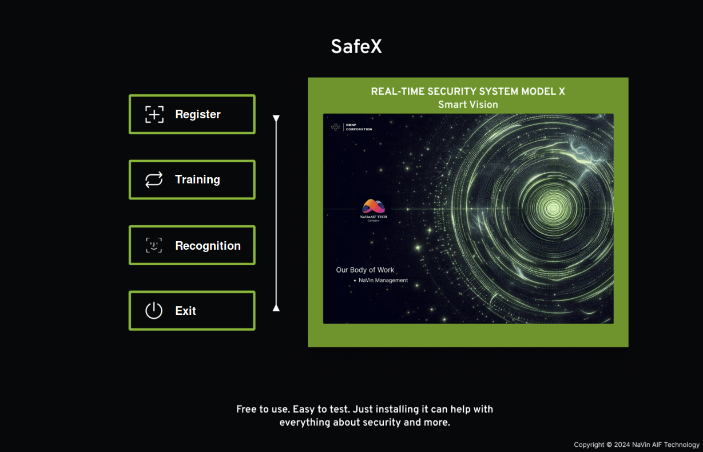
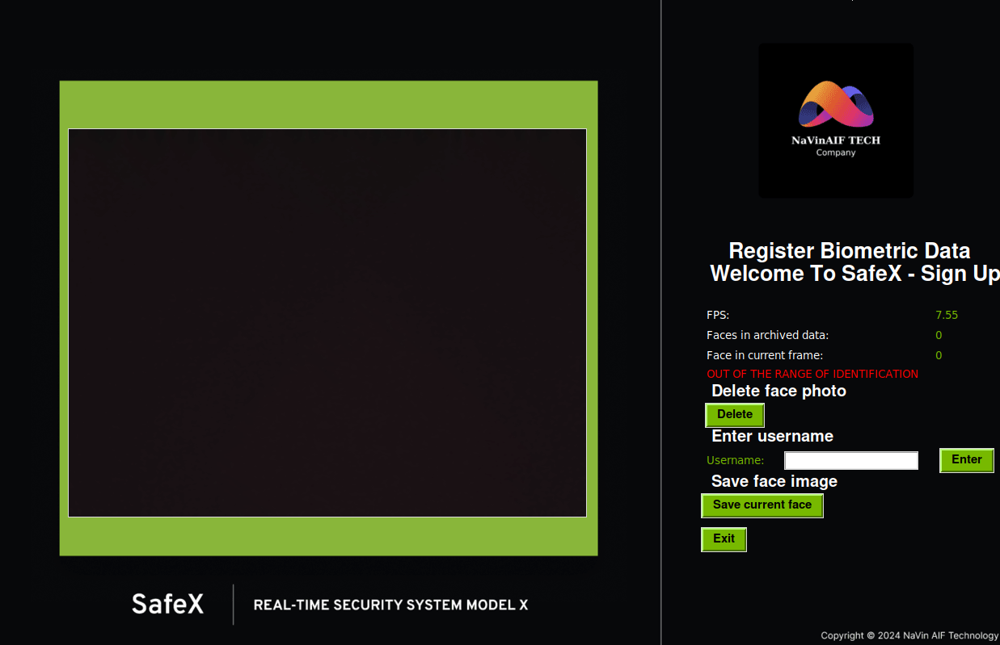

# SafeX - REAL-TIME SECURITY SYSTEM MODEL X (Version 2 - New Update)

[[X]](https://x.com/mih_cuog)
[[Info]]()
[[Demo]]()
[[Youtube]](https://www.youtube.com/channel/UC0yAbKYFWEa7PUqxDQA8m7w)

https://github.com/kyoo-147/SafeX/assets/126655047/f836c2ab-937b-4e98-a1e7-c18fbdc73caf

### Open your smart vision | Always keep you safe
Free to use. Easy to test. Just installing it can help with everything about security and more.
Identity & Access Control and Vehicle Management. Cloud storage & Data retrieval. Safety & Security Monitoring. 
SafeX can make some mistakes. Be considerate and always check important information. We will try to improve it.


## Approach

A system of trained and designed sequences to serve the community to develop and always keep the safety and security of users. The tasks are established and trained in a string that has been arranged. Multitasking operations are structured and set up according to standards. The optimal measures are also applied for it to operate smoothly on micro-devices.


## Setup

We used Python 3.8.10 and [Dlib](http://dlib.net/) 19.22.0 to train and test in real-time with our models, but the codebase is expected to be compatible with Python 3.7 - 3.11 and most recent versions of Dlib. The codebase also relies on a few Python packages, most notably [Pandas](https://pandas.pydata.org/) for implementing and performing your data processing operations. You can download and install (or update) the latest SafeX release with our instructions as follows: (We develop and test system with Ubuntu 20.4. However, it will still work well on Windows)

```bash
# Clone our repository
git clone https://github.com/kyoo-147/SafeX

# Let's go
# We test base
cd SafeX

# That's all you need
pip install -r requirements.txt

# Run SafeX
python3 X_Main.py
```

You can also create a virtual environment for your Python setup using [Virtual Environment](https://docs.python.org/3/library/venv.html) or [Anaconda](https://www.anaconda.com/), which makes it easier to manage packages and specify versions.

It also requires some additional detailed settings or performance boosts for your machine. You can refer to [Install Dlib](X_Instruction/INSTALL_DLIB_CUDA.md) and [Config Power](X_Instruction/CONFIG_POWER.md) for more details.


You should also check the connection with your IP camera (in our testing, we used the [Ezviz C6N](https://www.ezviz.com/de/product/c6n/22000) camera). You can find your RTSP address on the device's official page or in community forums. Refer to our [code snippet](X_Test/test_rstp.py) for testing the connection using our [RTSP method](X_Instruction/CONFIG_RTSP.md).

## Available models 

* [dlib_face_recognition_resnet_model_v1.dat](X_Center_Model/Model_Dlib/dlib_face_recognition_resnet_model_v1.dat)
* [shape_predictor_68_face_landmarks.dat](X_Center_Model/Model_Dlib/shape_predictor_68_face_landmarks.dat)

The CNN model is based on a Residual Neural Network (ResNet). Specifically, it is an optimized ResNet model with 29 layers. Essentially, this is a version of the ResNet-34 network from the paper [Deep Residual Learning](https://arxiv.org/abs/1512.03385) for image recognition, with some layers removed and the number of filters per layer reduced by half.

## Usage

Please run the [X_Main](X_Main.py) file mentioned earlier. In this interface, you can enter and register information and provide data for the system, then proceed with training and run the recognition mode.

### System Operation Explanation:

- **Without OT**: The program achieves the highest accuracy. When using a distance threshold of "0.6", the dlib model can achieve up to ``99.38%`` accuracy based on the LFW face recognition standard.
- **With OT**: Using OT, initial frame detection, subsequent frame tracking, and centroid-based OT are employed. Using OT saves computational time for facial descriptor calculations to improve FPS; however, you may have to sacrifice some accuracy.
- **Optimize**: This is the primary program chosen for the official system operation. It balances accuracy and operational performance, utilizing resources efficiently. The distribution of operational threads and data transmission is arranged to avoid quota bottlenecks. Refer to the [source code](X_Optimize.py) for more details.

## Database

We use [Firebase](https://firebase.google.com/) and [Google Sheets](https://www.google.com/sheets/about/) to simulate database storage and retrieval. You can refer to the code snippets we provided in [X_Utils](/X_Utils) for more details.

- [Refer to the sample database we provide](https://docs.google.com/spreadsheets/d/1Getoqe8Gsleuo9Lu96J8FCXbzUxPHiMQoL5YbArY2_U/edit#gid=0) - Please contact [us](mailto:ngoctuanvinh1332@gmail.com) to gain access.

## Demo
* You can contact me or our community to learn more, fine-tune, and upgrade whenever you need.




And you can watch [the product introduction video](https://www.youtube.com/channel/UC0yAbKYFWEa7PUqxDQA8m7w) to learn more details and see how it works. Don't forget to support us by liking and subscribing, as that will be a great motivation for us. Now we hope to help you further and automate your safety. We keep you safe.

Please contact NaVin AIF Techonology: [Hotline](0365646109) - [Email](ngoctuanvinh1332@gmail.com)

# License

MIT License (https://opensource.org/licenses/MIT).

All copyrights belong to Duong Minh Ngoc Phat Corporation & NaVin AIF Technology. 
Contact us for more details.

Copyright [SafeX](https://github.com/kyoo-147/SafeX) © 2024 Duong Minh Ngoc Phat Corporation & NaVin AIF Technology. All Rights Reserved
